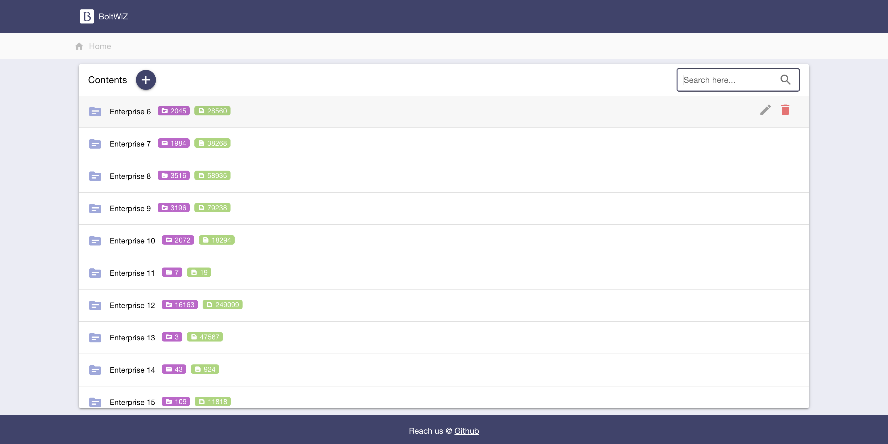
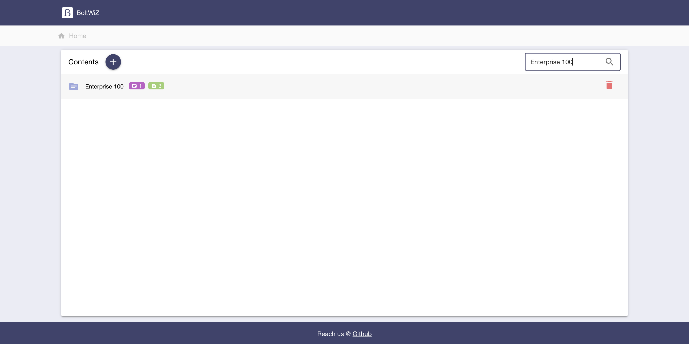
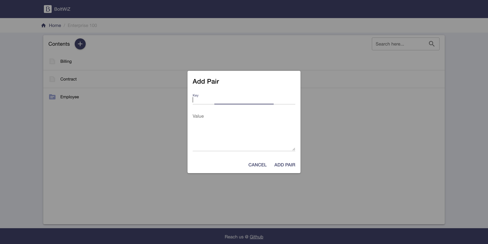
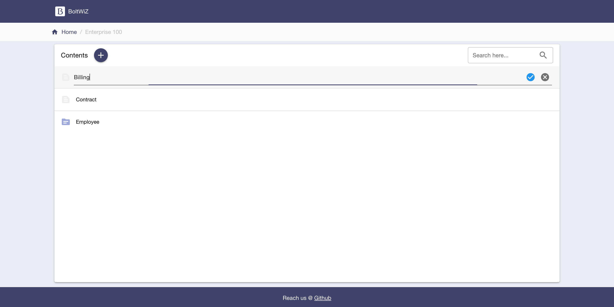
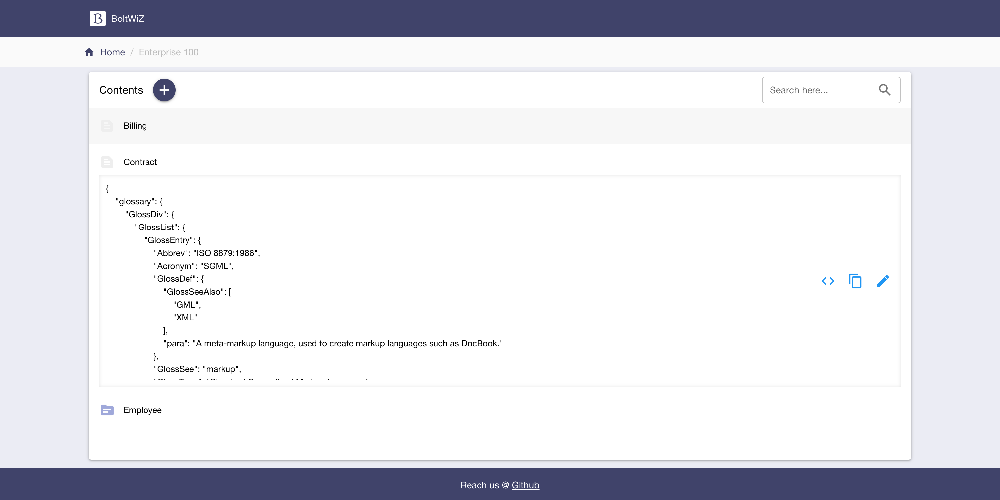

# BoltWiZ

Welcome to BoltWiZ, the ultimate UI tool for navigating and managing your BoltDB files with ease and precision. BoltWiZ simplifies your interaction with BoltDB, providing a user-friendly interface to perform CRUD operations more effectively.

## Key Features

- **List:** Effortlessly view all buckets or key-value pairs within the current hierarchy of your BoltDB file.
- **Search:** Quickly find child buckets or keys that match a specific substring, making data retrieval straightforward and fast.
- **Add:** Intuitively add new buckets or key-value pairs under the current bucket. At the root level, you have the ability to add new buckets.
- **Rename:** Conveniently rename the keys of pairs. (Note: Renaming of buckets is not yet supported, but we're working on it!)
- **Update:** Easily modify the value associated with a key in a pair under your current bucket.
- **Delete:** Safely remove a bucket or a key-value pair within your current hierarchy.

## Getting Started

## Installation Steps:

### Download the Executable

1. Open a terminal.

2. Download the `boltwiz` executable from Github:

> **Linux:**
> ```bash
> wget https://example.com/path/to/boltwiz
> ```
> **Mac OS:**
> ```bash
> wget https://example.com/path/to/boltwiz
> ```

3. Ensure the downloaded file has executable permissions:

   ```bash
   chmod +x boltwiz
   ```

### Run BoltWiZ

4. Run BoltWiZ with the specified `--db-path` argument:

   ```bash
   ./boltwiz --db-path /path/to/bolt.db
   ```

   Replace `/path/to/bolt.db` with the actual path of the BoltDB database you want to open.

   **Note:** If you encounter permission issues, you may need to use `sudo` or adjust file permissions accordingly.

## Additional Options

- For more command-line options and usage details, you can refer to the help documentation:

  ```bash
  ./boltwiz --help
  ```

## Screenshots







## Support and Feedback

If you encounter any issues or have questions, feel free to reach out to our support team at [Support Contact Information].

Thank you for using BoltWiZ!

**Basic Usage:**

1. Open BoltWiZ.
2. Connect to your BoltDB file.
3. Start browsing and managing your data.

**Advanced Features:** [Details on how to use advanced features]

## Why BoltWiZ?

- **User-Friendly Interface:** Designed for ease of use, making BoltDB management accessible to both beginners and experienced users.
- **Efficient Data Management:** Streamlines the process of managing data in BoltDB, saving you time and effort.
- **Comprehensive Functionality:** From basic listing to complex searching and updating, BoltWiZ covers all your BoltDB management needs.

## Support and Contributions

We are committed to improving BoltWiZ and welcome feedback and contributions from our user community.

- **Support:** For support, please contact [Support Contact Information].
- **Contributions:** If you're interested in contributing to the project, please see our [Contribution Guidelines](./CONTRIBUTION.md).

Thank you for choosing BoltWiZ for your BoltDB management needs!


Certainly! Here's how you can add the installation steps, including Go module download, to the README.md file:


# Project Setup

1. **Node.js and npm:**
Ensure you have Node.js and yarn installed on your machine. You can download and install them from [https://nodejs.org/](https://nodejs.org/).

2. **Navigate to the UI Directory:**
Change into your existing directory:

```bash
cd ui
```

3. **Install Node Dependencies:**
Install project dependencies for the ui:

```bash
yarn install
```

### Golang Server

4. **Install Golang:**
Install Golang on your machine. You can download the latest version from [https://golang.org/dl/](https://golang.org/dl/).

5. **Verify Golang Installation:**
Ensure Golang is installed correctly by running:

```bash
go version
```

This should display the installed Golang version.

6. **Download Go Modules:**
Navigate to the Golang server directory and run:

```bash
go mod download
```

This will download the Go modules specified in the `go.mod` file.

## Build Steps

### Vue 3 App

1. **Development Build:**
To run your existing Vue 3 app in development mode with hot-reload:

```bash
yarn serve
```

This will start a development server, and you can access your app at `http://localhost:8080`.

2. **Production Build:**
To build your existing Vue 3 app for production:

```bash
yarn build
```

The production build will be available in the `dist` directory. Deploy the contents of this directory to your web server.

### Golang Server

3. **Run Golang Server:**
Navigate to the Golang server directory and run:

```bash
go run main.go
```

This will start the Golang server.

**Important**: Make sure to build the UI before running the Golang server.

For more detailed information, refer to the official documentation of [Vue](https://v3.vuejs.org/), [Quasar](https://quasar.dev/), and [Golang](https://golang.org/doc/).

Thank you for choosing our project!