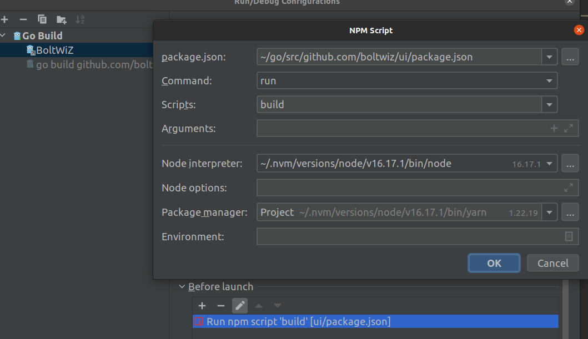

# Project Setup

1. **Node.js and npm:**
Ensure you have Node.js and yarn installed on your machine. You can download and install them from [https://nodejs.org/](https://nodejs.org/).

2. **Navigate to the UI Directory:**
Change into your existing directory:

```bash
cd ui
```

3. **Install Node Dependencies:**
Install project dependencies for the ui:

```bash
yarn install
```

### Golang Server

4. **Install Golang:**
Install Golang on your machine. You can download the latest version from [https://golang.org/dl/](https://golang.org/dl/).

5. **Verify Golang Installation:**
Ensure Golang is installed correctly by running:

```bash
go version
```

This should display the installed Golang version.

6. **Download Go Modules:**
Navigate to the Golang server directory and run:

```bash
go mod download
```

This will download the Go modules specified in the `go.mod` file.

## Build Steps

### UI

1. **Development Build:**
To run UI in development mode with hot-reload:

```bash
yarn serve
```

This will start a development server, and you can access your app at `http://localhost:8080`.

2. **Production Build:**
To build for production:

```bash
yarn build
```

The production build will be available in the `dist` directory. Deploy the contents of this directory to your web server.

### Golang Server

3. **Run Golang Server:**
Navigate to the Golang server directory and run:

```bash
go run main.go
```

This will start the Golang server.

> **Important**: Make sure to build the UI before running the Golang server.
> 
> For Goland, you can use before-launch configuration to build ui automatically before every run
> 
> 

For more detailed information, refer to the official documentation of [Vue](https://v3.vuejs.org/), [Quasar](https://quasar.dev/), and [Golang](https://golang.org/doc/).
